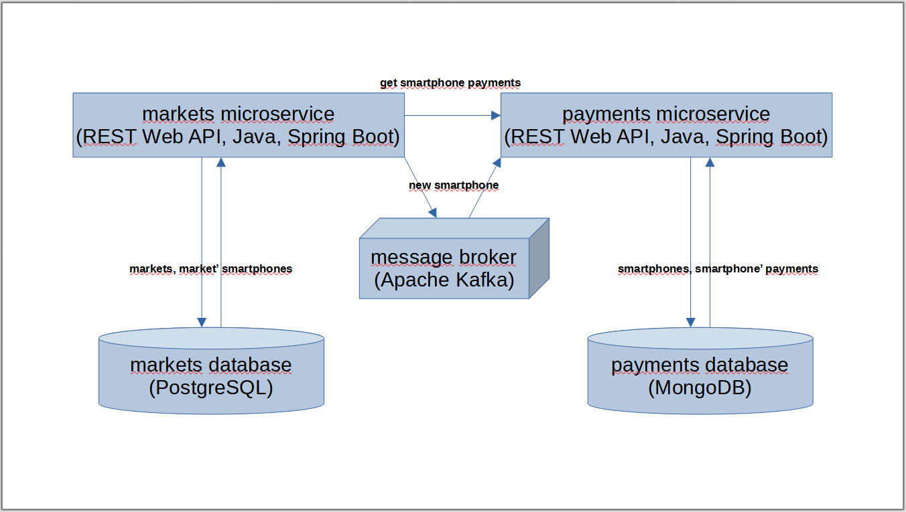

# Wbdsjunior's Tap on Phone

Tap on Phone é uma forma de receber pagamentos através de smartphones que possuam a tecnologia Near Field Communication (NFC), fazendo a leitura de cartões, pulseiras, smartwatches ou outros smartphones, por aproximação.

Este projeto visa criar um backend ([REST Web API](https://www.ics.uci.edu/~fielding/pubs/dissertation/rest_arch_style.htm)) para simular o cadastro de estabelecimentos, seus smartphones e pagamentos, utilizando, para fins didáticos, arquitetura de microsserviços, com tecnologia [Java](https://www.java.com/pt-BR), [Spring Boot](https://spring.io/projects/spring-boot), [PostgreSQL](https://www.postgresql.org), [MongoDB](https://www.mongodb.com/pt-br) e [Apache Kafka](https://kafka.apache.org), _tentando_ lançar mão de boas práticas de desenho, como: Object Calisthenics, Domain-Driven Design, Design Patterns (GoF, [PoEAA](https://martinfowler.com/books/eaa.html), [EIP](https://www.enterpriseintegrationpatterns.com) e etc.), Clean Code, SOLID Principles, [Clean Architecture](https://blog.cleancoder.com/uncle-bob/2012/08/13/the-clean-architecture.html) ([Hexagonal](https://alistair.cockburn.us/hexagonal-architecture)), [The Twelve-Factor App](https://12factor.net/pt_br) e etc., e documentado com a [The OpenAPI Specification](https://www.openapis.org).

## Arquitetura



## Docker (e docker compose)

### Para contruir o artefatos e contêineres:
```docker compose up -d --build```

### Para acessar a REST Web API
- [authentications](http://localhost:8180/swagger-ui/index.html)
- [markets](http://localhost:8280/swagger-ui/index.html)
- [payments](http://localhost:8380/swagger-ui/index.html)

### Para reiniciar os contêineres:
```docker compose restart```

### Para parar os contêineres:
```docker compose stop```

### Para inciar os contêineres (se estiverem parados):
```docker compose start```

### Para remover os contêineres do seu computador (ou servidor):
```docker compose down --remove-orphans --rmi local -v```
